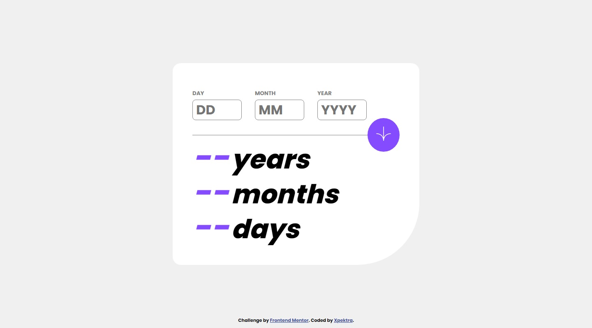

# Frontend Mentor - Age calculator app solution

This is a solution to the [Age calculator app challenge on Frontend Mentor](https://www.frontendmentor.io/challenges/age-calculator-app-dF9DFFpj-Q). Frontend Mentor challenges help you improve your coding skills by building realistic projects. 

## Table of contents

- [Overview](#overview)
  - [The challenge](#the-challenge)
  - [Screenshot](#screenshot)
  - [Links](#links)
- [My process](#my-process)
  - [Built with](#built-with)
  - [What I learned](#what-i-learned)
  - [Continued development](#continued-development)
- [Author](#author)


## Overview

### The challenge

Users should be able to:

- View an age in years, months, and days after submitting a valid date through the form
- Receive validation errors if:
  - Any field is empty when the form is submitted
  - The day number is not between 1-31
  - The month number is not between 1-12
  - The year is in the future
  - The date is invalid e.g. 31/04/1991 (there are 30 days in April)
- View the optimal layout for the interface depending on their device's screen size
- See hover and focus states for all interactive elements on the page

### Screenshot




### Links

- Solution URL: [Add solution URL here](https://github.com/Xpektra7/age-calculator)
- Live Site URL: [Add live site URL here](https://age-calculator-phi-swart.vercel.app/)

## My process

### Built with

- Semantic HTML5 markup
- CSS custom properties
- Flexbox
- Mobile-first workflow

### What I learned

-Form Validations
-Browser specific styling
-Cross browser compatibility.

```html
<h1>Some HTML code I'm proud of</h1>
```
```css
#form .input input{

  &::-webkit-inner-spin-button,&::-webkit-outer-spin-button{
    -webkit-appearance: none;
    margin: 0;
  }

  &:focus{
    border-color: var(--purple);
  }
}
```
```js
function calculateAge() {
  

  validateInput();

  const yearValue = year.value;
  const monthValue = month.value;
  const dayValue = day.value;


  if (validateInput()) {
    const birthTime = new Date(yearValue,monthValue-1,dayValue);
    
    const age = currentTime - birthTime;
    let yearAge = Math.floor(age/(3600 * 24 * 365 * 1000));
    let monthAge = ((Math.floor(age/(3600 * 2 * 365 * 1000))) % 12);
    let dayAge = Math.floor((age/(3600 * 24 * 1000)) % (365/12)) - 5;
    if (dayAge < 0){
      monthAge -= 1;
      dayAge += Math.floor(365/12);
    }

    ageYear.innerHTML = yearAge;
    ageMonth.innerHTML = monthAge;
    ageDay.innerHTML = dayAge;
  }       
}  

```


### Continued development

Use this section to outline areas that you want to continue focusing on in future projects. These could be concepts you're still not completely comfortable with or techniques you found useful that you want to refine and perfect.


## Author

- Website - [Xpektra](https://xpektra.vercel.app)
- Frontend Mentor - [@Xpektra7](https://www.frontendmentor.io/profile/Xpektra7)
- Twitter - [@xpektra7](https://www.twitter.com/Xpektra)


